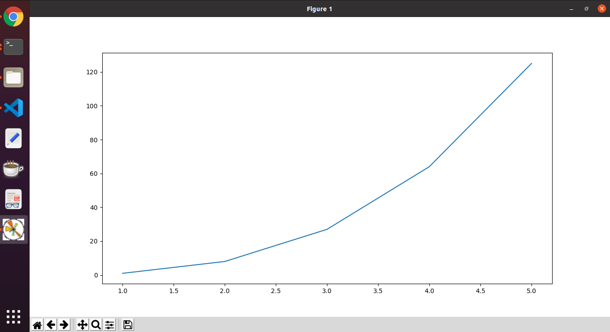
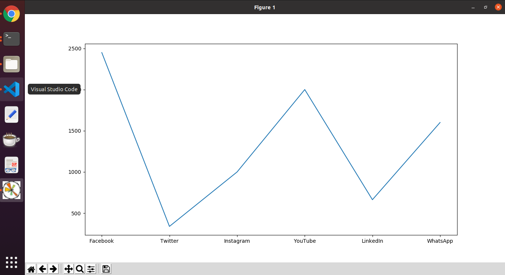
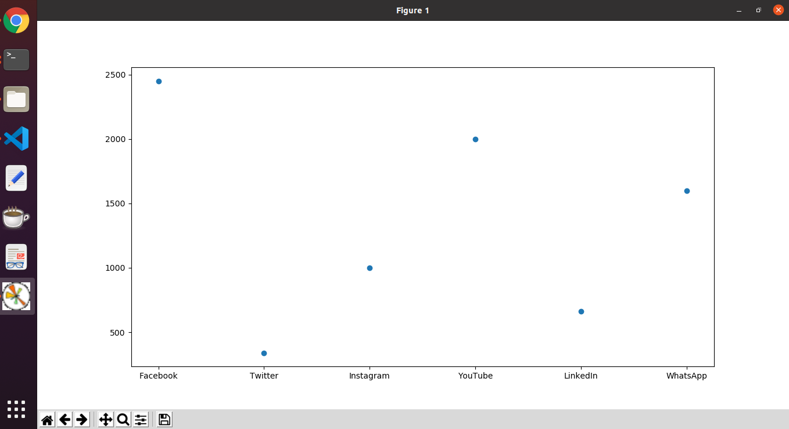
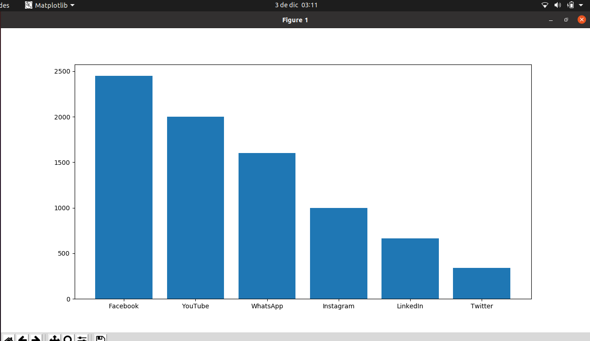
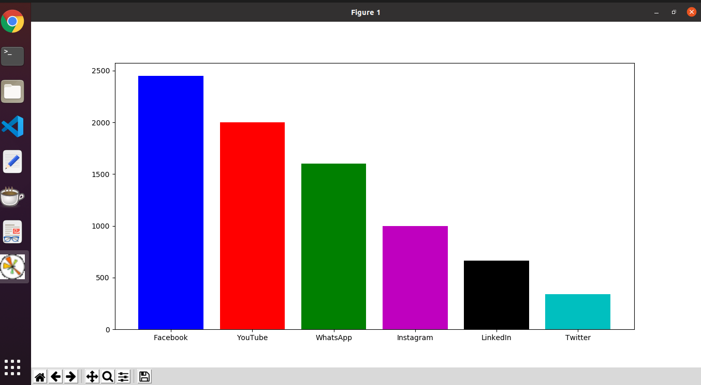

# CienciaDeDatos
La Ciencia de Datos nos permite usar una gran cantidad datos para generar información útil para la toma de decisiones.

<h2>Introducción</h2>

<h4>El aprendizaje de la Ciencia de Datos comprende:</h4>
<ol>
  <li>Aprendizaje automático o Machine Learning:  
    Salta de las entradas a las salidas de un modelo predictivo, sin detenerse en la lógica interna del problema real, para aprender a predecir el futuro a partir de los datos disponibles.</li>
    
  <li>Inteligencia Artificial:  
      Vincula las entradas con las salidas de un modelo pedictivo, pero siguiendo la lógica interna de los procesos simulados para calcular cual será el desarrollo de un proceso a lo largo del tiempo.
  </li>
  
  <li>Investigación Operativa:  
      Optimiza los procesos mediante algoritmos de maximización que se aplican  en diferentes circunstancias.
  </li>
  
  <li>Estadísticas:  
    Se estima los rangos de incertidumbre de las predicciones y a ls técnicas de manipulación de datos del tipo SQL y No SQL.
  </li>
</ol>

<h4>Posee dos singularidades</h4>
  <ul>
    <li>BIG DATA:  
    Se aplica cuando el volumen y complejidad de los datos nos lleva a la necesidad de procesar en paralelo en vez de usar un servidr SQL convencional.
    </li>
    <li>Deep Learning:  
      Se sitúa a mitad de camino entre la visión de la Inteligencia Artificial y la de Machine Learning para generar aprendizajes automáticos por etapas que tienen en cuenta la lógica del proceso.
    </li>
  </ul>
  
 <h2>Matplotlib</h2>
 
 Es una librería para gráfico de Python, sirve para crear gráficos 2D y algunos 3D para matemáticas y análisis de datos.
 
 <ol>
    Gráficas de puntos o líneas:
    <ul>
      <li>Gráfica básica.</li>
      <li>Visualización una cantidad considerable de datos.</li>
      <li>Buena para estudiar tendencias entre variables.</li>
    </ul>
 </ol>
 
 <ol>
    Gráficas de barras:
    <ul>
      <li>Buena para conteos.</li>
      <li>Agrupa datos para resumen.</li>
      <li>Fácil para explicar a otros.</li>
    </ul>
 </ol>
 
 <ol>
    Gráficas de pastel/torta:
    <ul>
      <li>Proporciones como ángulos.</li>
      <li>Tratar de no hacerlas en 3D.</li>
    </ul>
 </ol>
 

